# refactoring the cdc process

So, this project was created for two reasons, the first one is letting a template for every developer that needs to create a change data capture pipeline one functional version so their work would be a little easier. The system uses azure event hub and a database sql server stored in a docker image or like the other two  microservices.

The other reason was to use this project to explain some architectural code design choices as we go evolving the code.

So, this is the original version, as any project you should start with a brute force implementation, it doesn't make sense to refactor something that is not working

## the original version

## add the shebang and the encoding

The first thing you should put in every python file is the shebang so the system knows the interpreter it should use to execute them, and the encoding (so if they put something like an accent in a comment the system doesn't crash) . these two lines of code, must be in the first two lines of every python file.

## create the classes and objects

After we see the system working, let's start with the most fundamental part, creating class and objects

So the first things that we’ll do is move all the logic from the main python file to the class that should carry out the task of sending to event hubs those records coming through the api call

Now in the main python we only tell the class sender to do his job, also, remove every commented code, in order to store past versions of the code we use version control systems like git.

## variables that are not been used should be deleted

Another thing we should fix in this code is the presence of variables that are not been used, so that's memory been wasted.Notice how these variable name does not appear anywhere in the system. Using ctrl f in vs code (and a regular expression that look for the literal match of several variable names  -----> server|database|username|password|driver ) show us where those names appear.

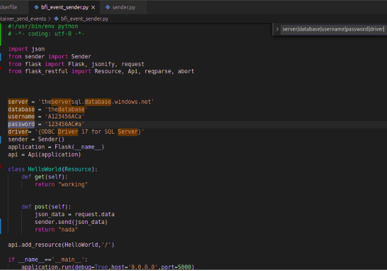

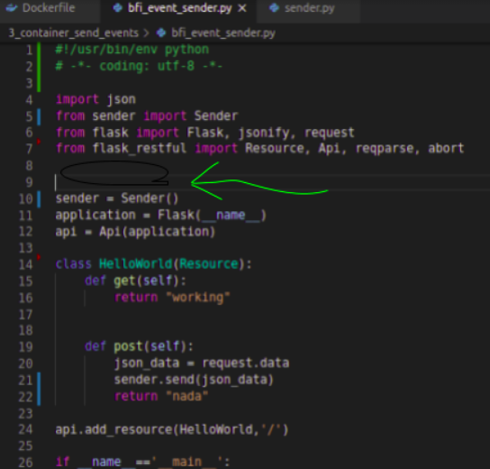

## git diff

I mean sure, you can see the plus a minus symbol but we both know that a graphical interface make out life easier

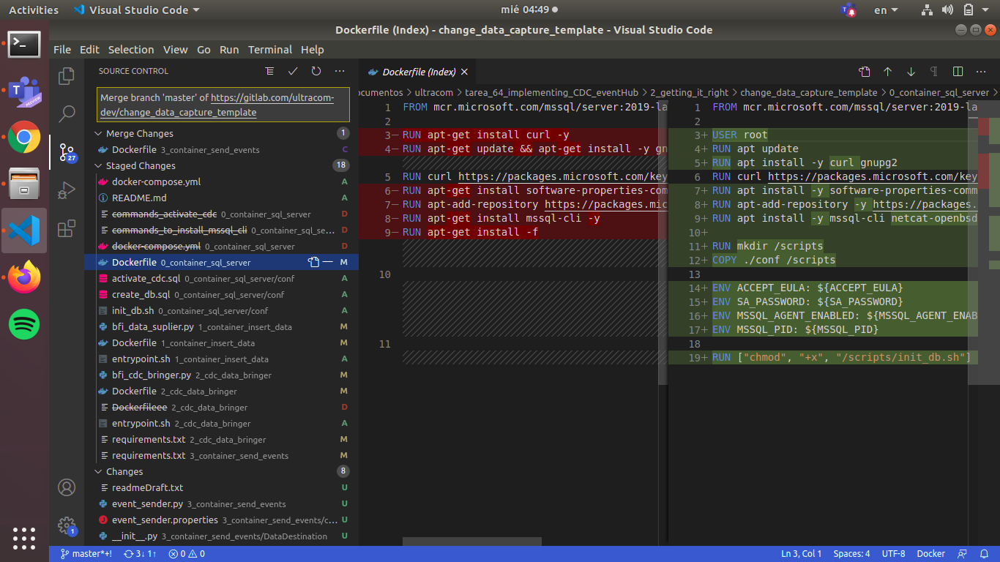

## merge conflict resolution

Something that may happen to you when you are colaborating with partners in a repository is the fact that both of you make changes in the same line so git does not know how to combine the versions of the file, that why it ask which of the two changes should make it to the final version. That is why we see one change in green the other one in blue, for the first button "accept current change" would ignore the changes than you friend made, "accept incomming change" would ignore your changes and the other would left both of them

## create a properties file to avoid hard coding connection strings

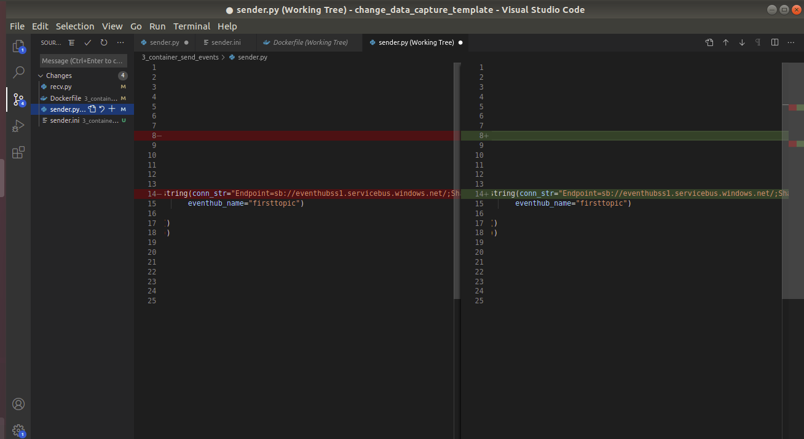

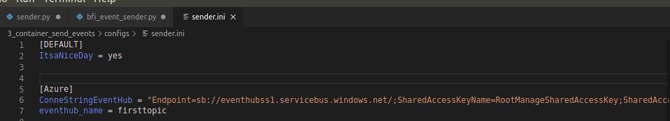

The location of the properties file itself should be passed as an argument to the main python file

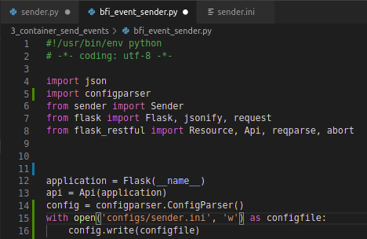

For that task python has the args library, where we can describe every argument. If you ever needed to know how to execute some program you know how useful the "someprogram -h" flag is.

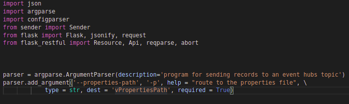

Pass the argument in the program execution section of the dockerfile

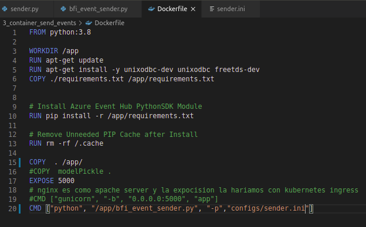

And remove the hardcoded section from the code

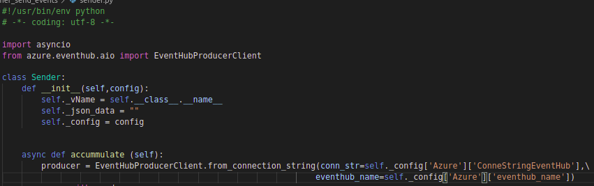

Check that everything continue working and do the git commit

## everything should be a class, including the program layer

To accomplish our goal of an extensible cdc python solution it should be easy to modify only the specific piece that we targeting.  As you can see we have a lot of different type of code in out main file, we have utilities (code not specific of a class but useful for several classes like the property file reader and the arguments reader), we have out api in here and also we have the starting point of our code in here. So let's create some classes to organize this mess.

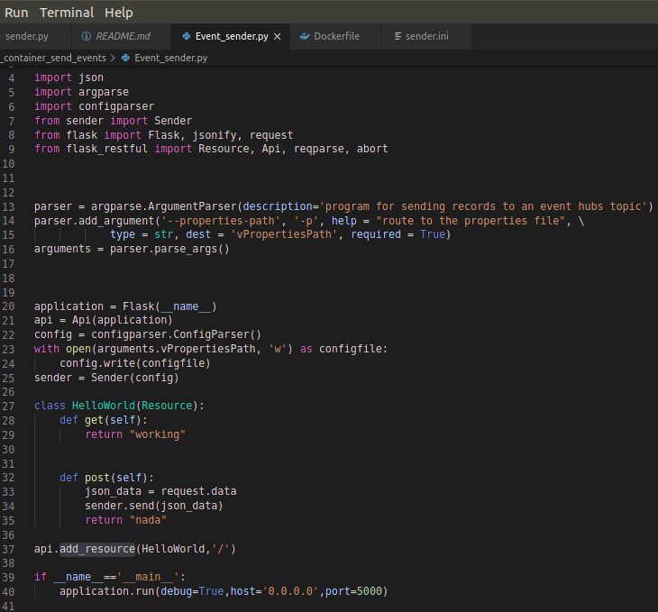

As a result, we have a cleaner main file.

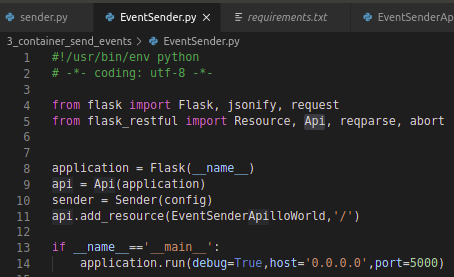