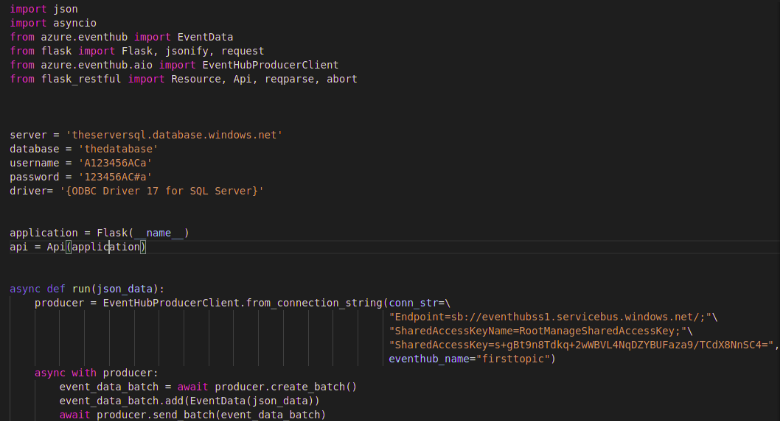
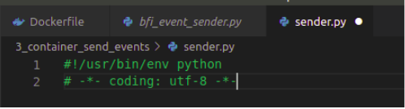
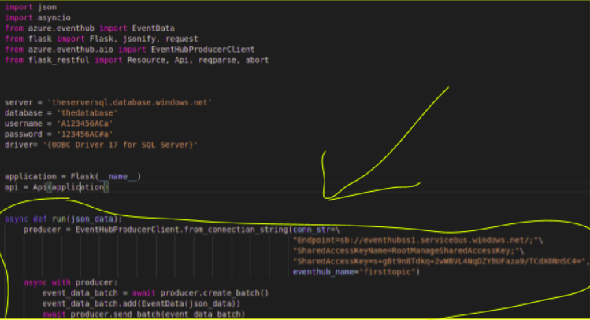
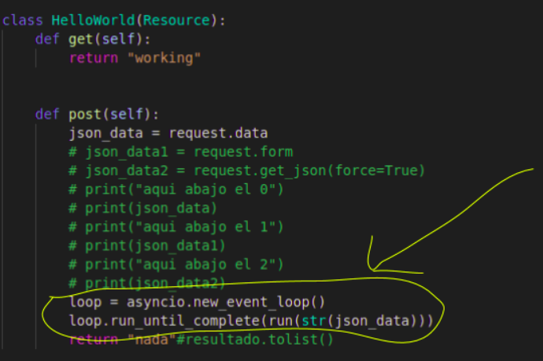
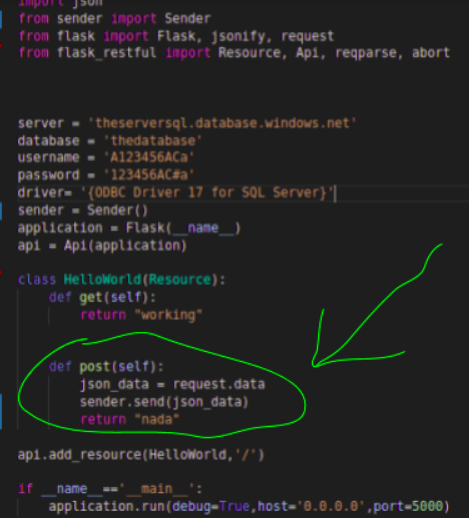

# refactoring the cdc process

So, this project was created for two reasons, the first one is letting a template for every developer that needs to create a change data capture pipeline one functional version so their work would be a little easier. The system uses azure event hub and a database sql server stored in a docker image or like the other two  microservices.

The other reason was to use this project to explain some architectural code design choices as we go evolving the code.

So, this is the original version, as any project you should start with a brute force implementation, it doesn't make sense to refactor something that is not working

## the original version

## add the shebang and the encoding

The first thing you should put in every python file is the shebang so the system knows the interpreter it should use to execute them, and the encoding (so if they put something like an accent in a comment the system doesn't crash) . these two lines of code, must be in the first two lines of every python file.

## create the classes and objects

After we see the system working, let's start with the most fundamental part, creating class and objects

So the first things that we’ll do is move all the logic from the main python file to the class that should carry out the task of sending to event hubs those records coming through the api call

Now in the main python we only tell the class sender to do his job, also, remove every commented code, in order to store past versions of the code we use version control systems like git.

